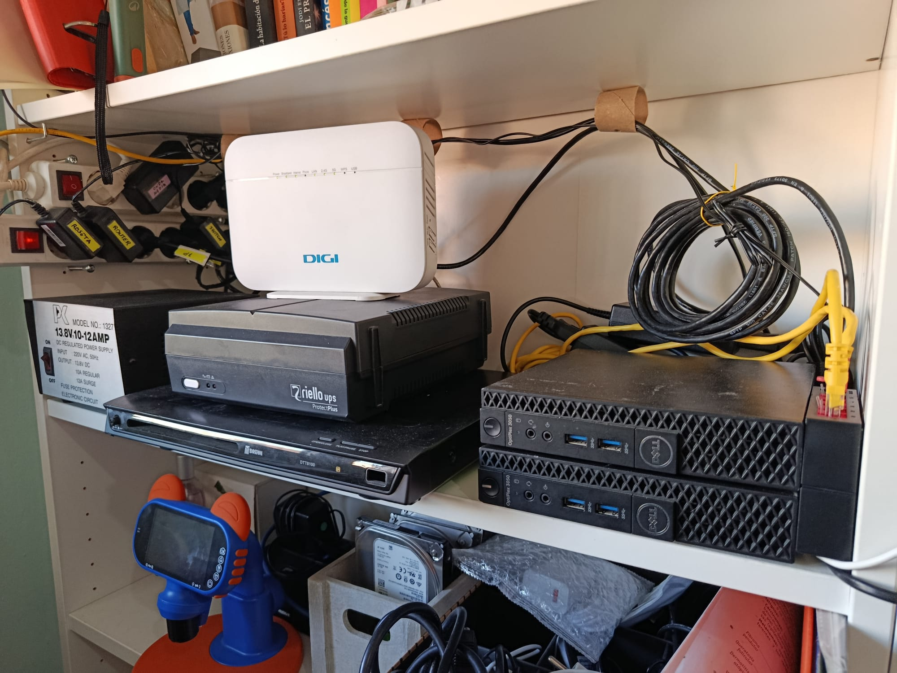
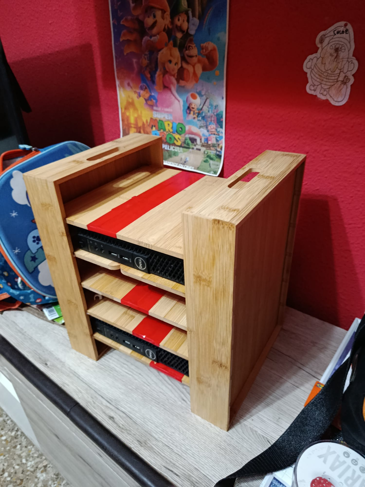
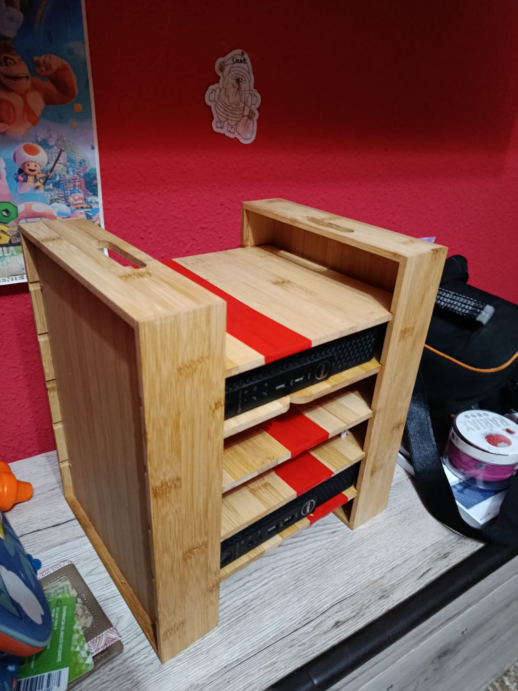
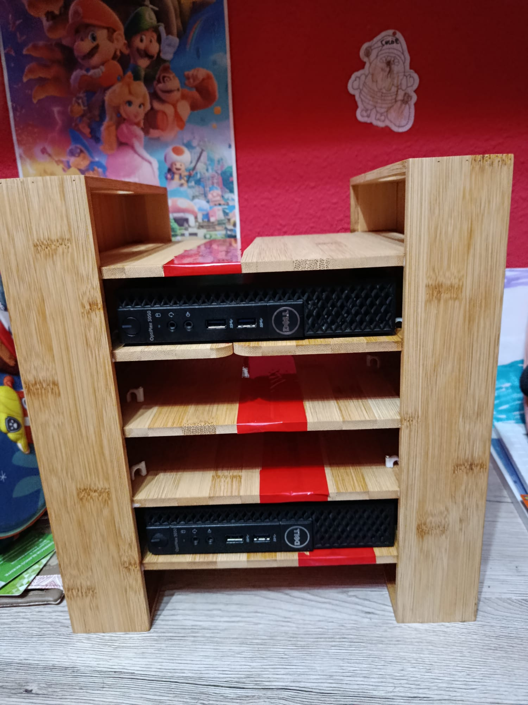
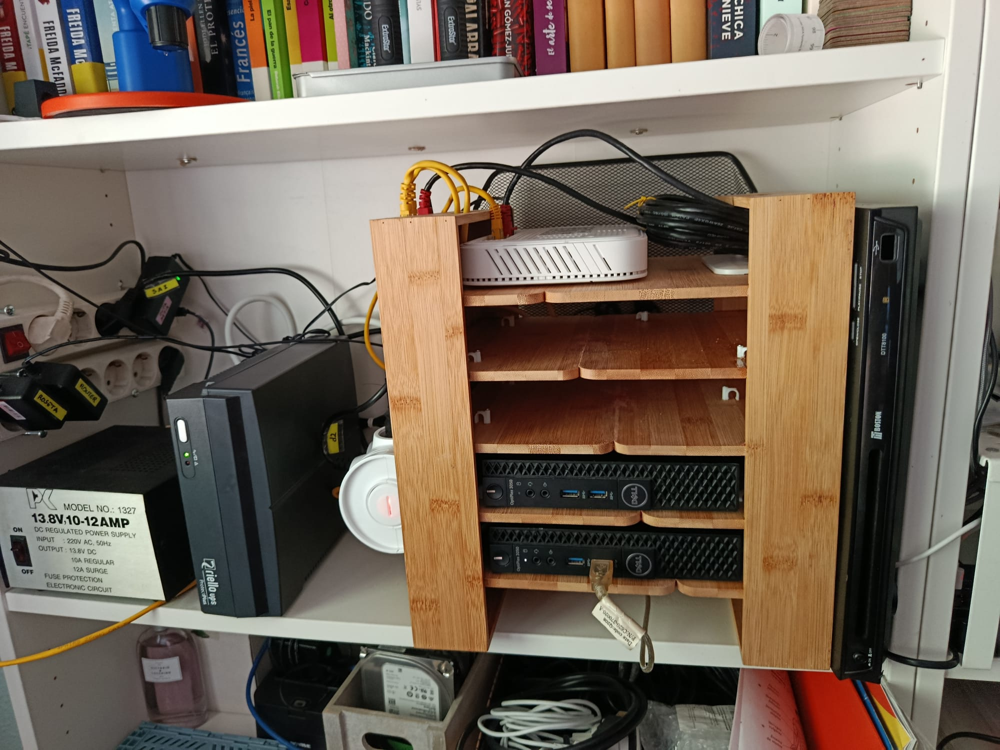

# Evolución del cluster D-Lab

Histórico fotográfico y breve descripción de la evolución física del laboratorio casero D-Lab. Para las especificaciones técnicas detalladas, ver [Hardware.md](./Hardware.md) y el estado autoritativo en [README-TECH.md](./README-TECH.md).

---

## Resumen cronológico

| Fecha | Hito | Imagen |
|-------|------|--------|
| Junio 2026 | Estado inicial: 2× Dell OptiPlex 3050 Micro apilados, cableado provisional | `20260629.jpeg` |
| Julio 2026 | Ampliación RAM 4 → 8 GB por nodo (Dual Channel) | — |
| 15–16 Jul 2026 | Cluster LXD unificado (4 contenedores) + ampliación a 2 masters / 2 workers | — |
| 28 Ago 2026 | Reorganización en mini-rack de bambú, orden de cableado y ventilación | `20260828-1/2/3/4.jpeg` |

> Todas las fotos viven en [`files/img/`](./files/img/).

---

## 1. Estado inicial — junio 2026

**Foto: `20260629.jpeg` (verificado 2026-06-29)**

Montaje original en la estantería blanca, sin rack dedicado:

- **2× Dell OptiPlex 3050 Micro** (D1 arriba, D2 abajo) apilados directamente uno sobre otro, en horizontal sobre el estante. Sin separación — riesgo de recirculación de aire caliente.
- **Router ZTE H3600P (DIGI)** apoyado sobre el **SAI Riello UPS Protect Plus 650** (caja negra). Debajo, decodificador TDT Boston DTT8100 usado como base.
- **Cableado**: mazo de RJ45 negros enrollados y bridados con cinta amarilla, latiguillos amarillos y fuente de 13,8 V (PK 1327) a la izquierda. Regleta con interruptores rojos y etiquetas `ROSETTA` / `ROUTER` / `SWITCH` / `SAI`.
- **Almacenamiento**: HDDs sueltos en caja de cartón bajo el estante (se ven etiquetas de discos de 500 GB / 3,5″), sin anclaje.
- **Carcasa DVD metalica**: Contiene los perifericos relativos al SDR aislados del ruido electromagnetico.
- **Contexto**: fase previa a la ampliación de RAM (4 GB Single Channel por nodo) y al cluster LXD unificado. El cluster LXC aún eran dos nodos independientes (`k8s-master-1` en D1, `k8s-worker-1` en D2). Iluminación natural; estantería compartida con libros y un microscopio infantil.

**Lecciones de esta fase**: funcionó para validar red estática (192.168.1.11/12), WireGuard y LXC, pero el apilado directo y el cableado sin guiar dificultaban mantenimiento y termal.

---

## 2. Ampliación de RAM — julio 2026

Sin foto dedicada; documentado en [Hardware.md §3](./Hardware.md#3-memoria-ram) y [README-TECH.md Fase 2.2](./README-TECH.md#fase-22--ampliación-de-memoria-ram).

- **Origen**: 1× 4 GB DDR4-2400 SODIMM por nodo (Single Channel), insuficiente para Kubernetes (el control-plane exige ≥2 GB solo para etcd/API Server).
- **Intervención (15 min)**:
  1. Módulo SK Hynix 4 GB de D2 → ranura DIMM2 de D1 (junto al Samsung existente).
  2. 2× Micron 4ATF51264HZ-2G3B1 4 GB nuevos → DIMM1+DIMM2 de D2.
- **Resultado**: **8 GB por nodo en Dual Channel** (verificado con `free -h` y `dmidecode -t memory`, 2026-07-15). Swap 4 GB en `nvme0n1p2`. Máximo soportado 32 GB (2×16 GB).

---

## 3. Cluster LXD a 4 contenedores — julio 2026

También sin foto; ver [README-TECH.md Fase 2.3 y 2.4](./README-TECH.md#fase-23--cluster-lxd).

- D1 y D2 se unifican en un único cluster LXD (`lxc cluster list`: D1 database-leader, D2 database-standby).
- Topología final: `k8s-master-1` (.21) + `k8s-worker-1` (.31) en D1, `k8s-master-2` (.22) + `k8s-worker-2` (.32) en D2. Gestión remota desde DV0 (IONOS, 394 MiB) vía WireGuard y wrapper `~/.local/bin/lxc` sin snapd.

---

## 4. Reorganización en mini-rack de bambú — 28 de agosto de 2026

**Fotos: `20260828-1.jpeg` a `20260828-4.jpeg` (verificado 2026-08-28)**

### 4.1 El mueble

| Vista lateral | Vista opuesta |
|---------------|---------------|
|  |  |

| Vista frontal |
|---------------|
|  |

Rack artesanal de bambú con 5 alturas útiles. **cada Dell tiene su propio nivel con flujo de aire entre pisos** (antes apilados sin hueco). 

### 4.2 Instalado en la estantería

Estado final en la estantería blanca:

- **Nivel superior del rack**: router ZTE/DIGI blanco tumbado en horizontal, con latiguillos amarillos/rojos saliendo por la trasera y el mazo de RJ45 negros recogido encima. El router ya no apoya sobre el SAI — mejor disipación.
- **Niveles intermedios vacíos**: reserva para futuros equipos.
- **Niveles inferiores**: D1 y D2 encajados en horizontal, frontales accesibles (botón, USB 3.0, jack). Cableado Ethernet conectado por detrás.
- **Lateral**: SAI Riello en vertical a la izquierda del rack (antes en horizontal bajo el router), con pilotos verdes activos.

**Beneficios**: orden visual, separación térmica, acceso frontal sin mover el conjunto, y cableado por la trasera del mueble integrados en el rack. El resto de la infraestructura no cambia: NVMe 256 GB + HDD 500 GB por nodo, red Gigabit `enp2s0` (Realtek r8169), alimentación protegida por el SAI.

